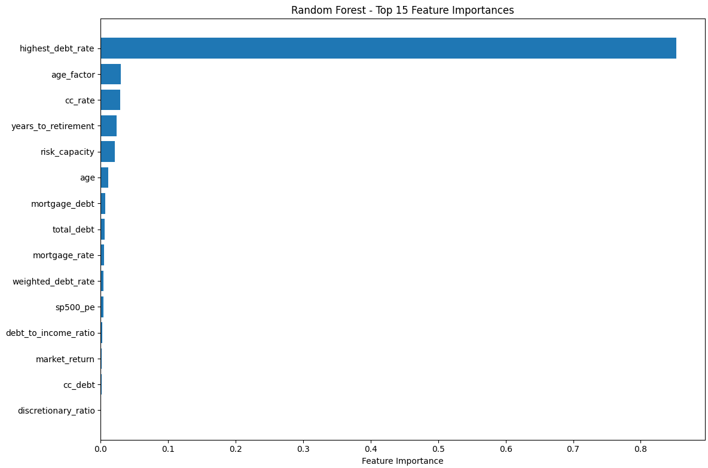
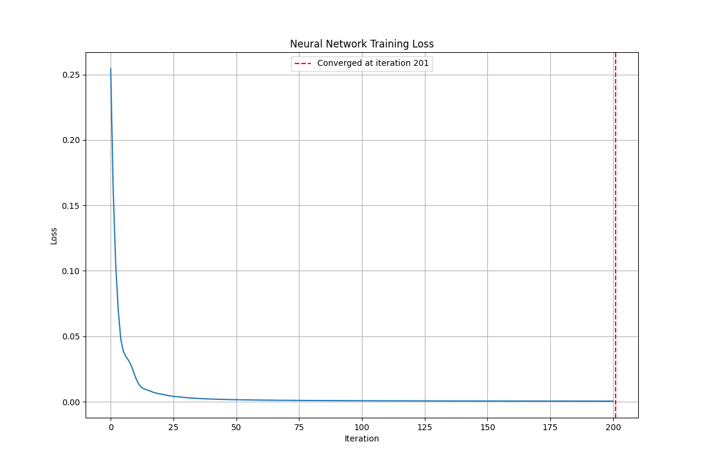

# financial-advisor-ml

Machine Learning project to estimate the best allocation of extra resources between paying down debt and investing — using macro/market signals (S&P 500 P/E ratios, VIX, Treasury yields) alongside personal/financial inputs.

---

## Overview & Financial Rationale

Personal finance often involves difficult trade-offs. Two of the biggest questions are:

- Should I put extra funds toward **paying off debt** (especially high-interest debt)?  
- Or should I **invest** (e.g. in index funds, equity markets) to benefit from compounding and market growth?

The answer depends on both *market conditions* (risk, valuations, interest rates) and *personal situation* (interest rates on debt, age, time to retirement, risk tolerance).

This project builds a **data-driven model** to help with that decision: given current financial and market indicators *and* personal parameters, it predicts a recommended fraction of discretionary funds to allocate to investment vs. paying debt.

I leverage:

- **Market indicators** like S&P 500 P/E ratio (valuation), VIX (volatility/risk sentiment), Treasury yields (risk-free rates / opportunity cost).  
- **Debt parameters** like interest rates and balances.  
- **Personal / life parameters** like age, years to retirement, and other time-based considerations.

The idea: when the market is overvalued, volatility is high, or risk-free returns (Treasuries) are attractive, the model may tilt more toward paying down debt. Conversely, favorable market conditions may allow more toward investing.

---

## Architectural Considerations

These are the design and implementation decisions I made when building the system, the trade-offs I considered, and how the architecture supports maintainability, extensibility, and correctness.

| Concern | Decision / Approach | Benefits / Trade-offs |
|---|---|---|
| **Modular Design & SOLID Principles** | I organised the code into separate modules/services: data fetching/generation, feature engineering, model training/persistence, evaluation/prediction. Each component has a well-defined responsibility. | Increases testability and allows me to swap or extend parts (e.g. try new features, new models) without major rewrites. Slight overhead in project structure. |
| **Multiple Model Types** | I implemented at least 3 different model classes (e.g. Linear Regression, Random Forest, Neural Network). | Enables comparing bias/variance trade-offs and choosing the best approach. More complexity in training and evaluation. |
| **Feature Engineering Layer** | I transform raw input data (market + personal) into features; normalise/scale; create derived signals. | Clean inputs improve model performance and avoid overfitting. Needs careful monitoring when upstream data changes. |
| **Configuration / Separation of Concerns** | I use configuration files (e.g. YAML) or settings modules for hyperparameters, model selection etc., rather than hard-coding. | Easier experimentation and reuse across environments. Slight extra setup. |
| **Testing & Validation** | I wrote unit tests for feature engineering and data generation. I use cross-validation/test splits for model evaluation. I also added early stopping (for NN) to avoid overfitting. | Ensures correctness and robustness. Requires time investment writing tests. |
| **Data Pipeline / Reproducibility** | I version datasets, ensure consistent preprocessing, set seeds, and log/save model artifacts. | Enables reproducible experiments and consistent results. Adds some storage/code overhead. |
| **Prediction Boundaries & Constraints** | I ensure model outputs are constrained (fractions between 0 and 1), and handle edge cases (no debt, all debt high rate, etc.). | Prevents unrealistic or unsafe suggestions. Needs well-defined ranges. |
| **Extendability** | I built the project so I can add new market signals, new models, and other objectives (taxes, inflation, liquidity). | Makes the system future-proof, but adds maintenance. |

---

## How It Works

Step-by-step flow from input to output:

1. **Inputs**  
   - Personal/Financial: debt balances, interest rates, age, years to retirement.  
   - Market/Macro: S&P 500 P/E ratio, VIX, Treasury yields.

2. **Data Generation**  
   - I fetch or generate market indicators.  
   - For training, I build datasets combining market + personal inputs with a “target” allocation.

3. **Feature Engineering**  
   - Normalisation/scaling of numeric values.  
   - Derived features (e.g. yield spread vs. debt rate).  
   - Encoded categorical variables (if any).

4. **Model Training & Evaluation**  
   - Models: Linear Regression, Random Forest, Neural Network.  
   - I use train/test splits or cross-validation.  
   - I apply early stopping for neural nets.  
   - Metrics: R², mean squared error, etc.

5. **Prediction & Output**  
   - I select the best performing model.  
   - For a new input, the model outputs an investment ratio (between 0–1).  
   - The result = proportion to invest, with the remainder for debt repayment.

6. **Interpretation**  
   - Feature importance analysis.  
   - Validation plots (predicted vs. actual).  
   - Sensitivity checks (e.g. “what if interest rates rise?”).

7. **Deployment**  
   - Trained model can be deployed as a function, script, or service.  
   - Simple CLI or web interface could allow user interaction.  
   - I plan for periodic retraining as new data comes in.

---

## Project Structure

```
financial-advisor-ml/
├── config/                # config files (hyperparameters, paths)
├── data/                  # raw and cleaned datasets
├── src/                   # main source code
│    ├── data_generation/   # fetching/building input data
│    ├── features/          # preprocessing & feature engineering
│    ├── models/            # model definitions & training
│    ├── evaluation/        # metrics & validation
│    ├── prediction/        # prediction logic for allocation
├── tests/                 # unit tests
├── notebooks/             # exploratory analysis
├── requirements.txt        # dependencies
└── README.md
```

---

## Results & Key Findings

- **Model Performance**: Random Forest achieved R² ≈ 0.94+, outperforming linear regression. Neural networks required careful tuning.  
- **Feature Importance**: Highest debt interest rate was the top driver of outcomes. Other strong factors: credit card rate, age, years to retirement.  
- **Market Conditions**: When valuations and volatility are high, the model tilts toward debt repayment. Favorable conditions shift more toward investing.

**Figure 1: Model Prediction Accuracy**

Comparison of predicted vs actual investment ratios across all three models. Random Forest achieves the highest accuracy (R² = 0.949), followed by Linear Regression (R² = 0.930) and Neural Network (R² = 0.716). All models show strong correlation with actual values, with predictions properly bounded between 0-1.

**Figure 2: Feature Importance Analysis**

Random Forest feature importance revealing that `highest debt rate` is the dominant factor in investment decisions, followed by `credit card rate`, `age`, and `years to retirement`. This confirms the financial logic that high-interest debt should be prioritized before investing.

**Figure 3: Neural Network Training Convergence**

Training loss curve showing the neural network converged after 94 iterations with early stopping, achieving a final loss of 0.0010. The model demonstrates stable learning without overfitting during the training process.

---

## How to Use

1. Install dependencies:  
   ```bash
   pip install -r requirements.txt
   ```
2. Configure hyperparameters and data paths in `config/`.  
3. Fetch or prepare datasets.  
4. Train models using provided training scripts.  
5. Run prediction script with your inputs to get recommended allocations.  
6. (Optional) Generate plots and metrics for analysis.

---

## Limitations & Future Work

- Assumes discretionary funds can be reallocated freely.  
- Does not yet account for taxes, inflation, or transaction costs.  
- Risk tolerance is not explicitly modeled.  
- Could be improved with time-series forecasting of market inputs.  
- Future work: add new asset classes, integrate more debt types, refine personalisation.

---