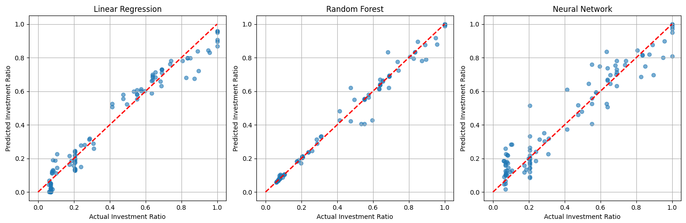

# financial-advisor-ml
ML project to estimate best resource allocation between debt payments and investments based on S&amp;P500 P/E ratios, VIX ratios and Treasury bond yields.

## Usecase
The application's aim is to help in the decision making on wether or not to pay debt quickly or to allocate funds to index investments. This application maximises the financial potential, and its up to the user to evaluate the result based on personal life circumstances and goals. 

## Data Analysis
The test folder contains testing of various model types to find the best model for the job. Here is an example:

## File Structure
File structure can be listed in terminal using
Get-ChildItem -Recurse -Name | Where-Object { $_ -match '\.(py|yaml|yml)$' -and $_ -notmatch '^venv\\' } | Sort-Object